# Programa Aula, Escuela y Comunidad
A continuación, se presenta una visualización del funcionamiento del sitio web PAEC del Cobaeh Plantel Xuchitlán, San Salvador, Hidalgo. 
Las imágenes muestran cómo los usuarios pueden acceder a información detallada sobre el PAEC, descargar planeaciones y explorar catálogos didácticos. 
El diseño con HTML, CSS y JavaScript garantiza una plataforma educativa accesible y funcional, facilitando el acceso y la interacción con los recursos educativos ofrecidos.

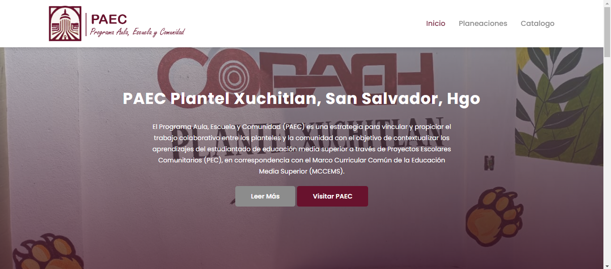
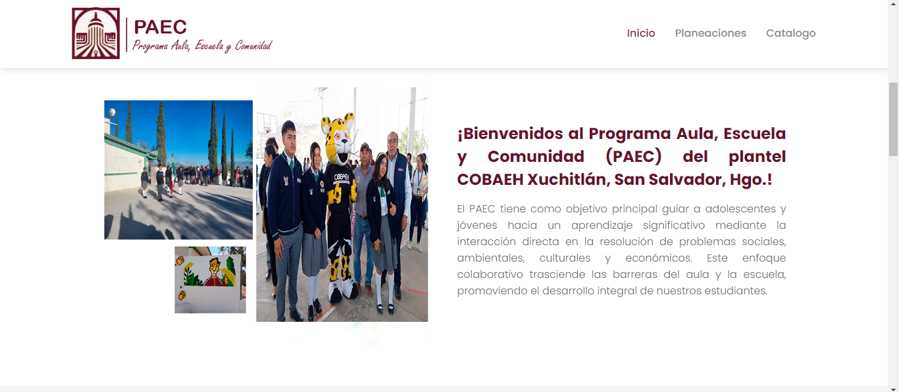
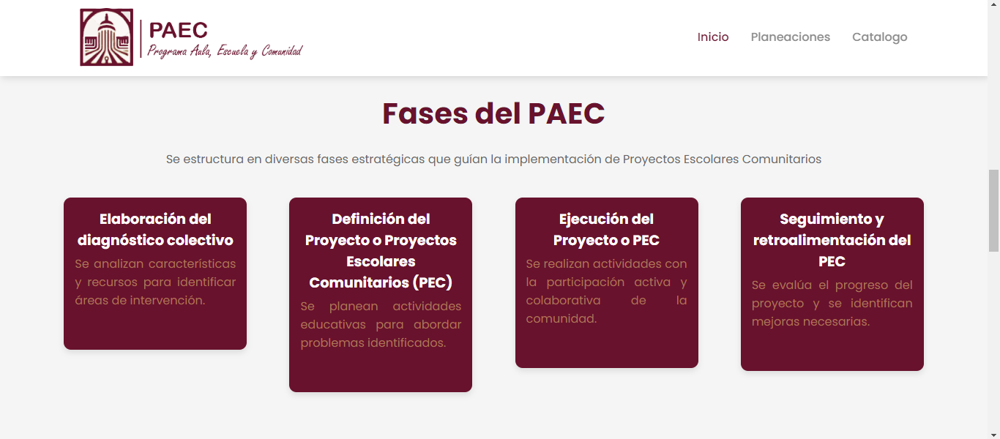
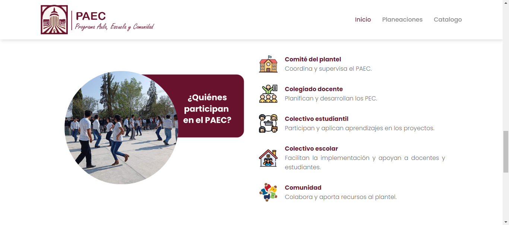
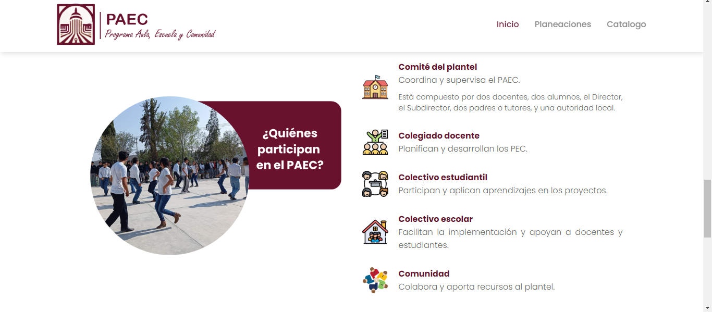
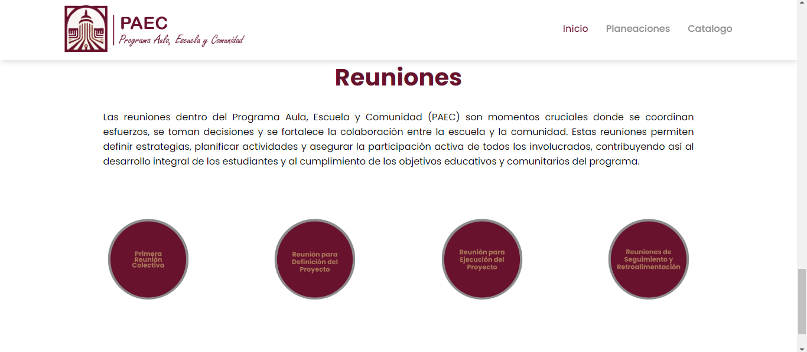
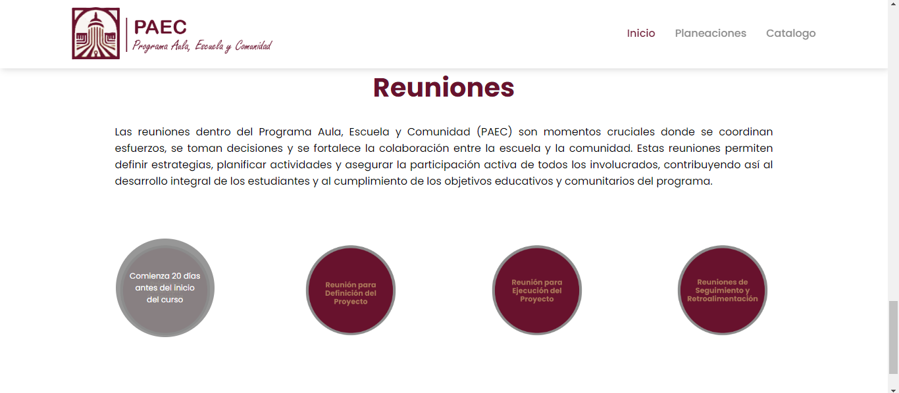
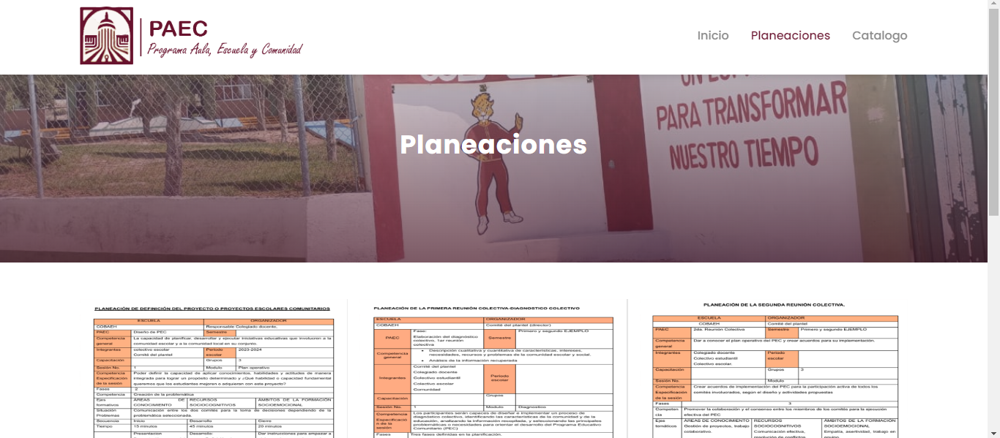
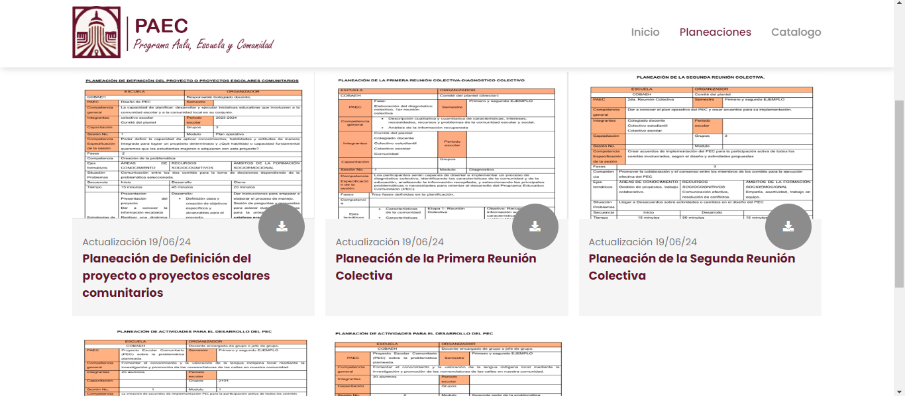
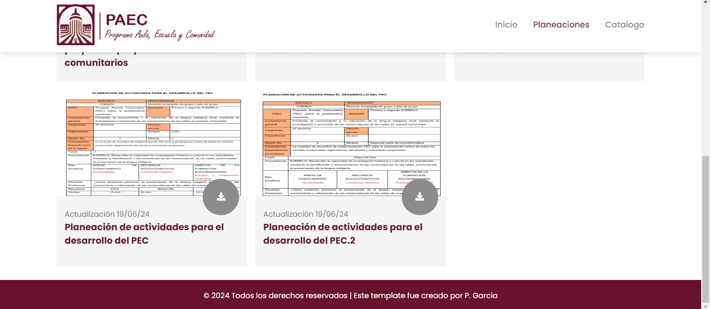
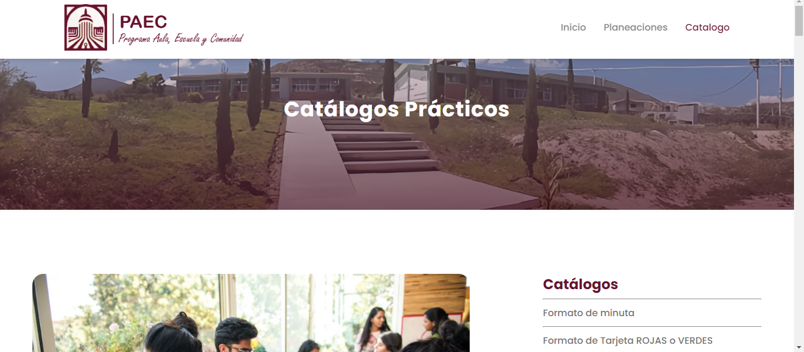
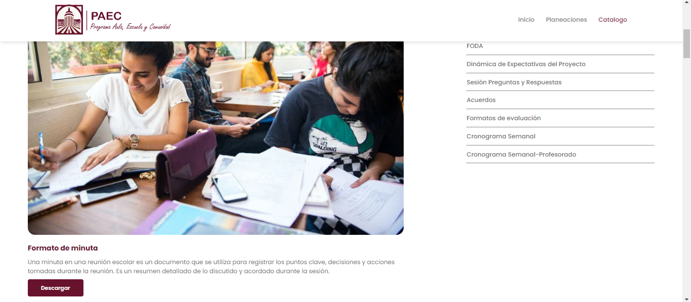
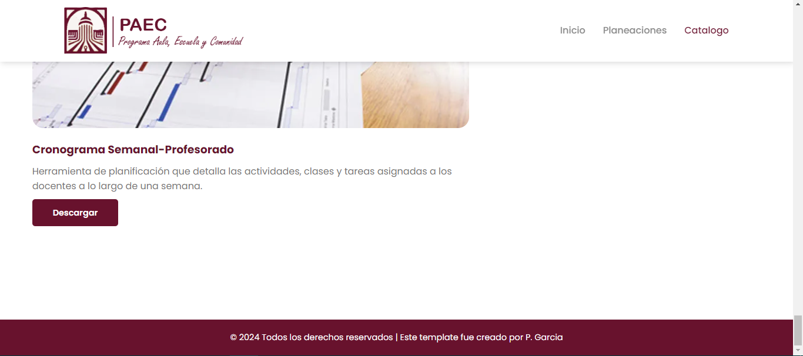
